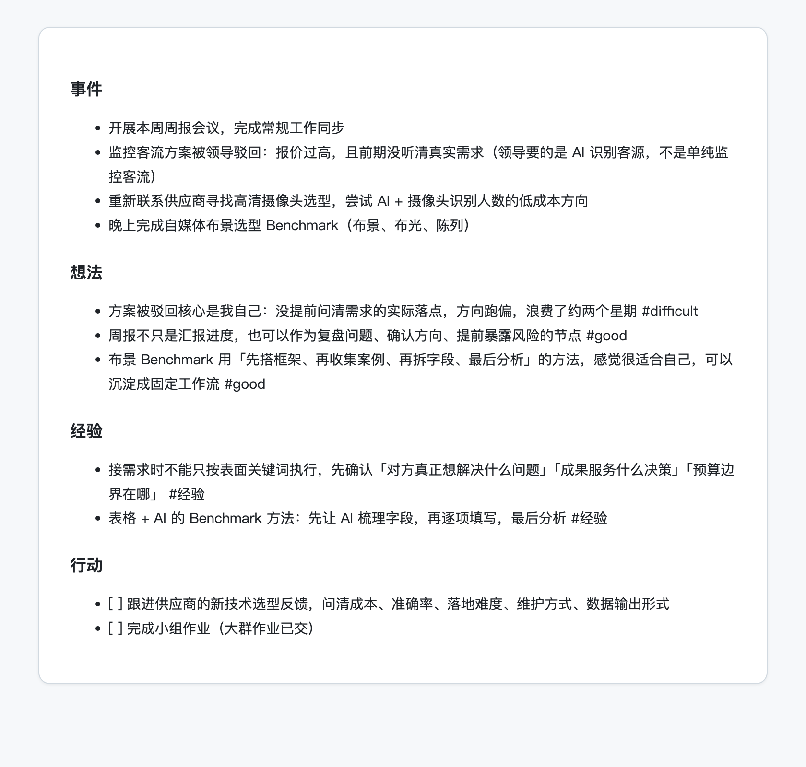
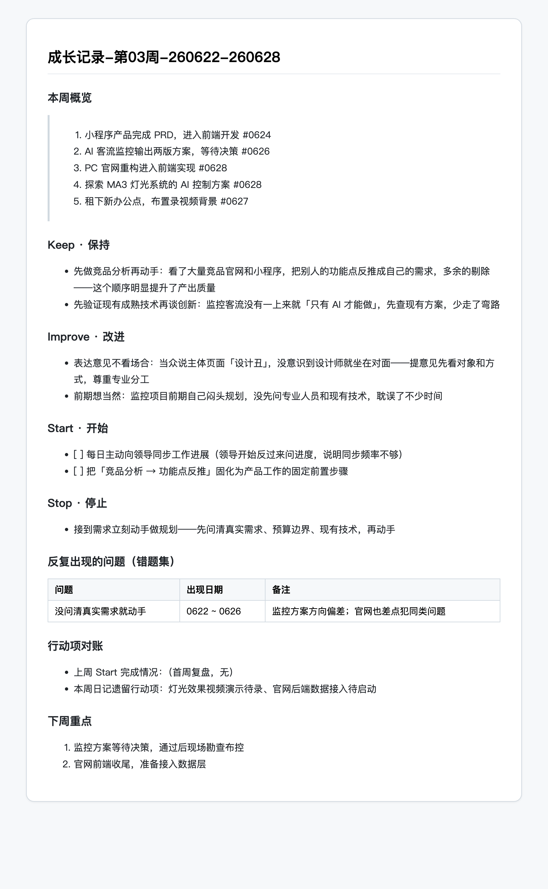
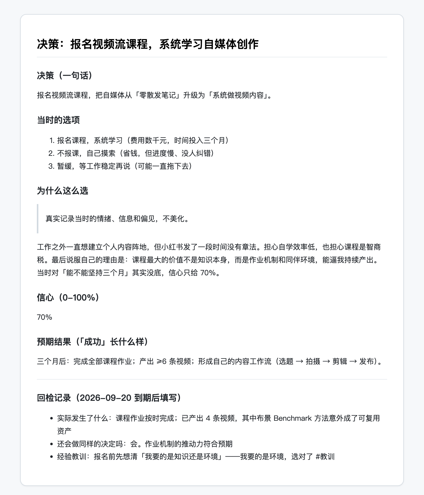
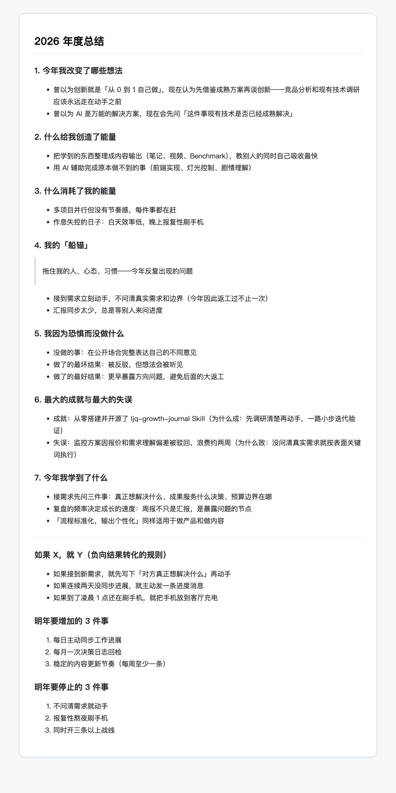
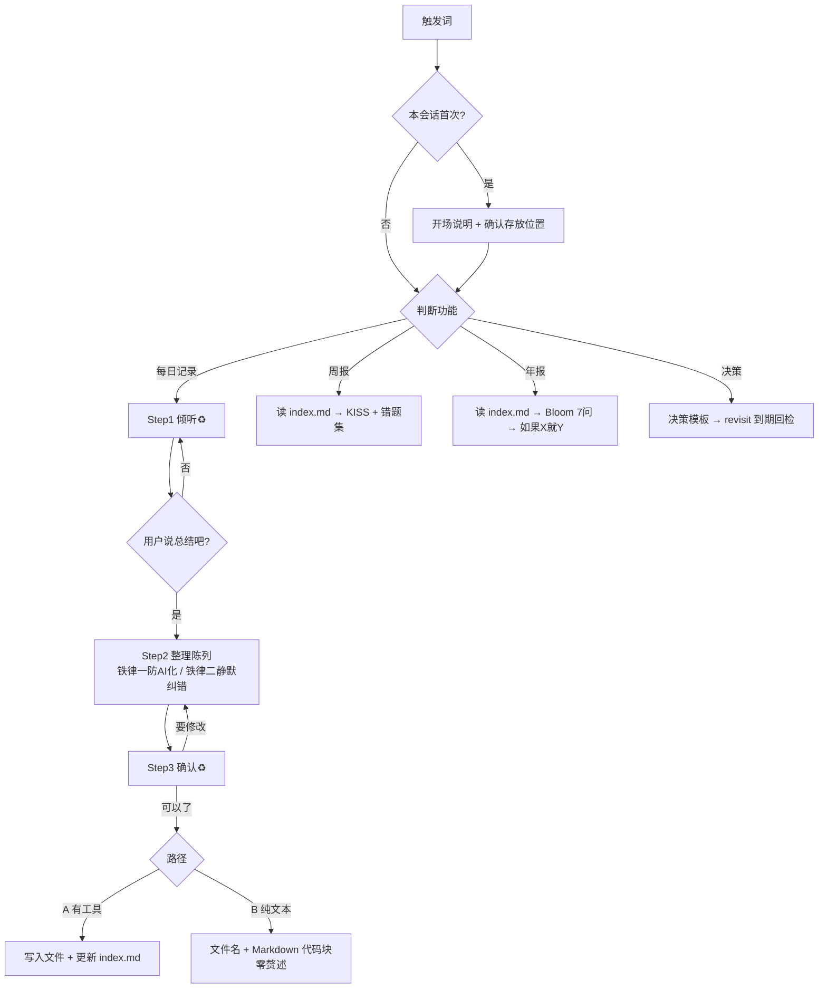

# Growth Journal · 个人成长记录 Skill

[English](README.en.md) | **中文**

> 你说话，AI 听着；整理成块，你确认，再落盘。
> 记录给自己看，也给未来的 AI 看。

---

## 为什么做这个 Skill

调研了 20+ 个主流个人记录实践（子弹笔记、晨间日记、GTD、KISS/GRAI 复盘、决策日志、量化自我、GitHub 上的 LifeOS 与 AI Journaling 项目）之后，我们发现它们收敛于同一个结论：

> **复盘能带来复利，不复盘只有随机。**

记录本身不产生复利——**回看才产生**。而市面上大多数记录工具只解决了「记下来」，没有解决「回看循环」。这个 Skill 把回看做成了一等公民：每日记录、每周复盘、年度总结、决策回检，四层回看机制全部内置。

同时，在 AI 时代，你的个人记录还有第二层价值：**它是未来一切 AI 应用调用你个人经历时的数据源**。写日记找素材、做自媒体复盘、让 AI 帮你发现「这个问题我怎么又犯了」——前提是记录必须「人机双读」：人看得舒服，AI 检索得动。这就是本 Skill 全部格式设计的出发点。

## 特性

- **对话式记录**：随便说（语音口述也行），AI 只倾听不评价；你说「总结吧」，它整理成四块结构，你确认后才落盘
- **双路径执行**：有文件工具的 AI Agent（Kimi / Claude Code 等）直接写入 Obsidian 库；任何纯对话大模型（手机端豆包 / Kimi 等）输出纯净 Markdown 自行保存，功能不阉割
- **原汁原味，防 AI 化**：「事件/行动」可提炼成条目，「想法/经验」必须保留你的原句原词——禁止润色、禁止拔高、禁止 AI 腔
- **语音口述友好**：明显的语音误识别静默纠正不打断倾诉；没把握的词标【？】，确认时统一问一次
- **人机双读格式**：标准 Markdown + YAML frontmatter + 内联标签，天然兼容 Obsidian（Daily Notes / Periodic Notes / Dataview）
- **记忆索引**：落盘模式自动维护 `index.md` 全库目录，写周报年报先读索引再读全文，库再大也快
- **四层回看机制**：日记 → 周报（KISS + 错题集）→ 年度总结（Sahil Bloom 7 问）→ 决策回检（Decision Journal）

## 效果预览

真实填充示例（源自实际使用，已脱敏），完整文件见 `assets/examples/`：

| 日记 | 周报 |
|---|---|
|  |  |

| 决策日志 | 年度总结 |
|---|---|
|  |  |

## 安装

### 方式一：作为 Skill 安装（支持 Skills 的 AI 环境）

将 `ljq-growth-journal.skill` 解压（它本质是一个 zip 包），把 `ljq-growth-journal/` 文件夹放入你的 Skills 目录：

```
~/.config/agents/skills/     # 推荐
~/.kimi/skills/
~/.claude/skills/
# 或项目级：<你的项目>/.agents/skills/
```

AI 会在你说出触发词时自动加载。

### 方式二：纯文本使用（任何大模型，含手机端）

打开 `SKILL.md`，把全文粘贴为系统提示词（或直接发给 AI 说「之后按这份规则执行」），即可使用。没有任何依赖。

## 使用方式

### 触发词

| 口令 | 功能 |
|---|---|
| 记一下 260801 / 写日记 / 记录今天 / 今日复盘 | 每日记录 |
| 写周报 / 周复盘 / 总结这周 | 周报 |
| 写年度总结 / 年度回顾 / 总结今年 | 年度总结 |
| 记录一个决策 / 今天做了个重要决定 | 决策日志 |
| 开启观察模式 / 关闭观察模式 | 切换 AI 是否主动给观察（默认关闭） |

（触发是语义理解，不是精确匹配——意思相近的说法同样有效。）

### 一次完整的每日记录

```
你：记一下 260801
AI：（首次：说明玩法 + 确认存放位置，之后只回「收到（今日记录完了就发『总结』）」）
你：……（随便说，语音口述也行，说几轮都行）
你：就这些，总结吧
AI：把今天整理成「事件 / 想法 / 经验 / 行动」四块，完整陈列给你
你：改一下 XX / 可以了
AI：路径 A：写入 journal/2026/08/成长记录-第1天-20260801.md，并更新 index.md
    路径 B：只输出一行文件名 + 一个 Markdown 代码块，零赘述
```

流程内口令：「就这些 / 没了 / 总结吧」结束倾听；「可以了 / 保存吧」确认执行。

## 输出格式（语法说明）

### 日记文件

```markdown
---
date: 2026-08-01        # 必填，标准日期格式（Obsidian 兼容）
tags: [工作, 健康]       # 维度标签：不限量，从内容自动提取，可随时新增
mood:                   # 可选，提到情绪才填
decision: false         # 有重大决策时为 true
revisit:                # 决策回检日期（decision 为 true 时填）
---

## 事件      # 客观发生了什么（骨架，允许提炼成条目）
- 

## 想法      # 感受与反思（血肉，必须保留原话）
- #good        做得好的
- #difficult   卡住的
- #different   想改变的

## 经验      # 想明白的道理（未来写作的素材库）
- #经验 / #教训

## 行动      # 待办（下次记录时 AI 会追问完成情况）
- [ ] 
```

**规则**：所有区块可选，空着是合法记录；维度用标签承载，不设固定栏目。

### 标签体系

- **固定功能标签（5 个）**：`#good` `#difficult` `#different`（想法）+ `#经验` `#教训`（经验/决策）——结构锚点，供周报错题集与 AI 检索使用
- **开放维度标签（不限量）**：frontmatter 的 `tags:` 从内容提取（工作/健康/财务/人际/学习……只是示例），随人生阶段自由增删

### 文件命名

| 类型 | 路径 | 示例 |
|---|---|---|
| 日记 | `journal/YYYY/MM/成长记录-第N天-YYYYMMDD.md` | `journal/2026/08/成长记录-第1天-20260801.md` |
| 周报 | `weekly/成长记录-第XX周-YYMMDD-YYMMDD.md` | `weekly/成长记录-第03周-260622-260628.md` |
| 年度总结 | `yearly/年度总结-YYYY.md` | `yearly/年度总结-2026.md` |

命名是大众化默认值——你提出任何偏好，AI 无条件以你的为准。

### 周报「本周概览」示例

概览只陈述发生了什么，不写经过与评价，句尾带日期标签：

```markdown
## 本周概览

> 1. 电影院看《蜘蛛侠-崭新之日》，用 AI 辅助补背景知识 #0731
> 2. 家里停电几天，作息紊乱 #0730
> 3. 做了 ljq-growth-journal Skill 并开源到 GitHub #0801
```

## 结构总览

### Skill 包结构

```
ljq-growth-journal/
├── SKILL.md                  # 主文件：触发词 / 双路径 / 流程 / 铁律
├── 说明.md                   # 本文件（中英双语）
├── references/               # 延伸功能（按需加载）
│   ├── weekly-review.md      # 周报：KISS + 错题集
│   ├── annual-review.md      # 年度总结：Bloom 7 问 + 如果X就Y
│   └── decision-log.md       # 决策日志 + revisit 回检
└── assets/
    ├── templates/            # 落盘模板
    │   ├── daily.md
    │   ├── weekly.md
    │   ├── annual.md
    │   └── decision.md
    └── examples/             # 真实填充示例（模板给形状，示例给标准）
        ├── daily-example.md
        └── weekly-example.md
```

### 生成的日记库结构

```
日记库/（位置自定，可直接放进 Obsidian 库）
├── index.md                            # 记忆索引：每篇一行的全库目录（仅落盘模式）
├── journal/YYYY/MM/成长记录-第N天-YYYYMMDD.md
├── weekly/成长记录-第XX周-YYMMDD-YYMMDD.md
├── yearly/年度总结-YYYY.md
└── decisions/                          # 决策日志（可选）
```

### 执行逻辑

```
ljq-growth-journal 执行逻辑/
├── 1.触发/  日记线 · 周报线 · 年报线 · 决策线
├── 2.开场（仅首次一次）/  说明玩法 + 确认存放位置
├── 3.日记线（核心）/
│   ├── Step1 倾听♻️：不评价不打断
│   ├── Step2 整理陈列：frontmatter + 四块结构
│   │   ├── 铁律一·防AI化：骨架可提炼，血肉必须原话
│   │   └── 铁律二·静默纠错：存疑词标【？】统一问
│   ├── Step3 确认♻️：改 → 回Step2；可以了 → Step4
│   └── Step4 执行分流：路径A写文件+更新索引 / 路径B纯净输出
├── 4.周报线：读index.md → KISS草稿+错题集 → 确认 → 落盘
├── 5.年报线：读index.md → 全年周报 → Bloom 7问 → 如果X就Y → 3+3
├── 6.决策线：理由/信心/预期/revisit → 到期主动回检
└── 7.历史联动（仅路径A）：行动项追问 · 历史同日 · 决策回检扫描
```



## 设计哲学

1. **事件 / 想法 / 经验 / 行动四分结构**——子弹笔记、GDD 闪念、记事随想模板三个独立来源收敛
2. **维度用标签承载，不设固定栏目**——随时增删，可跨天汇总
3. **frontmatter + Markdown + 日期命名**——人机双读的事实标准
4. **回看循环是复利的唯一定义**——连用日记、决策 revisit、周复盘、年度回顾
5. **克制与留白**——所有字段可选，空着是合法记录，不强迫填满
6. **具体优于概括，真实高于体面**——不美化当时的偏见，否则只是在用结果改写记忆
7. **AI 人格可配置**——倾听还是批判，是使用者的开关（默认倾听，「开启观察模式」切换）

## 一些我们相信的话

> 允许一切发生，让它们自然流淌。

> 写真心话才有意义。

> 真实记录当时的情绪、信息和偏见，不要美化——否则你只是在用结果改写记忆。

> 流程标准化，输出个性化。

> 不为记录而记录，为目标而记录。

> 具体优于概括。

> 我们在想象中受的苦，比在现实中多。——塞涅卡

> 认识你自己。——德尔斐神庙铭文

## 致谢与参考

设计理念调研自：[lifeos-template](https://github.com/seandavi/lifeos-template)、[ai-journaling-template](https://github.com/TimoBakx/ai-journaling-template)、[myself_skeleton](https://github.com/cnxzcxy/myself_skeleton)（GitHub）；《晨间日记的奇迹》（佐藤传）；[子弹笔记法](https://bulletjournal.com)；GDD 闪念笔记工作流；KISS / KPT / GRAI / PDCA / 4Fs 复盘模型；[Sahil Bloom 个人年度回顾](https://www.sahilbloom.com/newsletter/the-personal-annual-review)；Tim Ferriss Past Year Review；决策日志（Decision Journal）实践；Quantified Self 社区；Obsidian 官方文档与社区模板生态。

## License

[CC BY 4.0](https://creativecommons.org/licenses/by/4.0/) — 可自由使用、修改、分发，署名即可。

